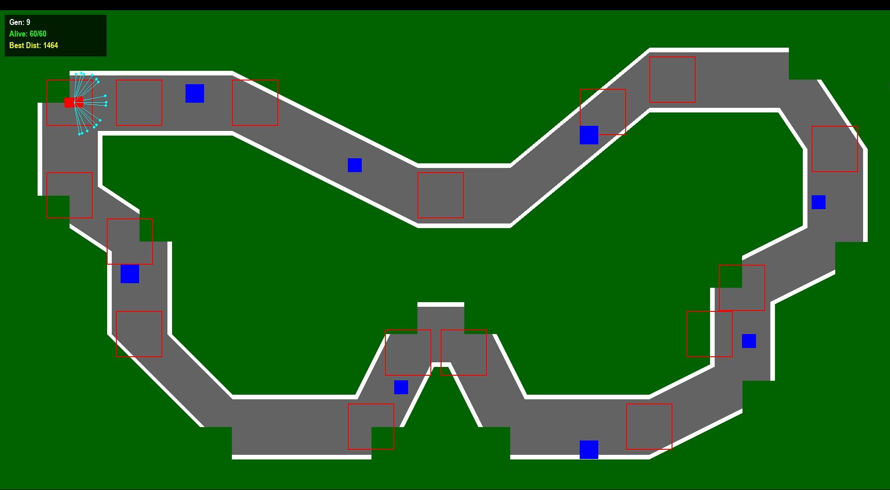
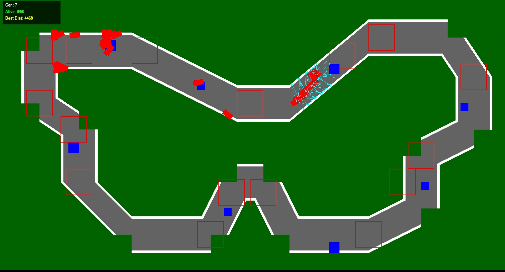
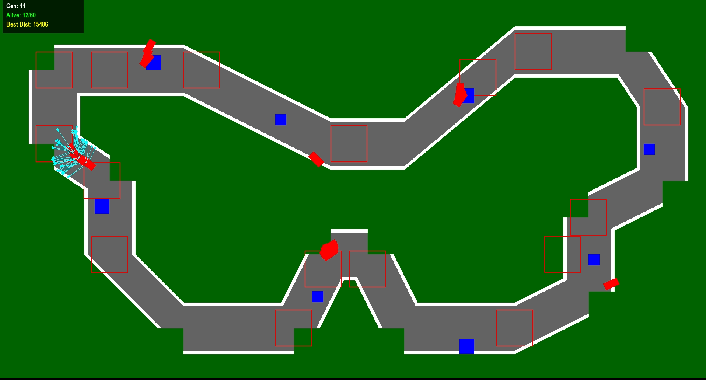

# Self-Driving Car with Micrograd & Neuroevolution

A 2D autonomous driving simulation built from scratch in Python. This project implements a **Genetic Algorithm** to train a Neural Network, allowing cars to learn how to navigate a track without any pre-programmed driving logic or external ML libraries like PyTorch/TensorFlow.




## 🧠 About The Project

The core goal of this project was to understand the "black box" of Deep Learning. Instead of using high-level APIs, I utilized **Micrograd**—a tiny, scalar-valued Autograd engine—to build the Neural Network architecture manually.

Unlike traditional Supervised Learning, this project uses **Neuroevolution** (Genetic Algorithms). The cars are not told *how* to drive; they are subject to "Survival of the Fittest," evolving better driving behaviors over generations.

### Built With
* **Python**
* **Pygame** (Rendering & Physics)
* **Micrograd** (Neural Network Architecture)

## ⚙️ How It Works

### 1. The Sensors (Input)
The car is equipped with **5 Ray-Cast Sensors** that measure the distance to the nearest wall.

* These normalized distance values are fed into the Neural Network.

### 2. The Brain (Architecture)
The brain is a **Multi-Layer Perceptron (MLP)** built on the Micrograd engine.
* **Topology:** `[5 inputs] -> [16 hidden] -> [16 hidden] -> [1 output]`
* **Activation:** ReLU / Tanh (depending on implementation)
* **Output:** A single scalar value determines the steering angle (Left, Right, or Straight).

### 3. The Learning (Evolution)
The training process bypasses Calculus (Backpropagation) in favor of Darwinian Evolution:
1.  **Spawn:** A generation of 60 cars is initialized with random weights.
2.  **Evaluate:** Cars drive until they crash. Their "Fitness" is determined by the checkpoints and the distance from each checkpoint.
3.  **Selection:** Using **weighted selection from the top 5**, the best-performing cars are chosen as parents.
4.  **Mutation:** The offspring inherit weights from parents with slight random mutations.
5.  **Repeat:** This loop continues, optimizing the network weights for survival.

## 🚀 Getting Started

### Prerequisites
You need Python installed. The only external dependency for visualization is Pygame.

```bash
pip install pygame
